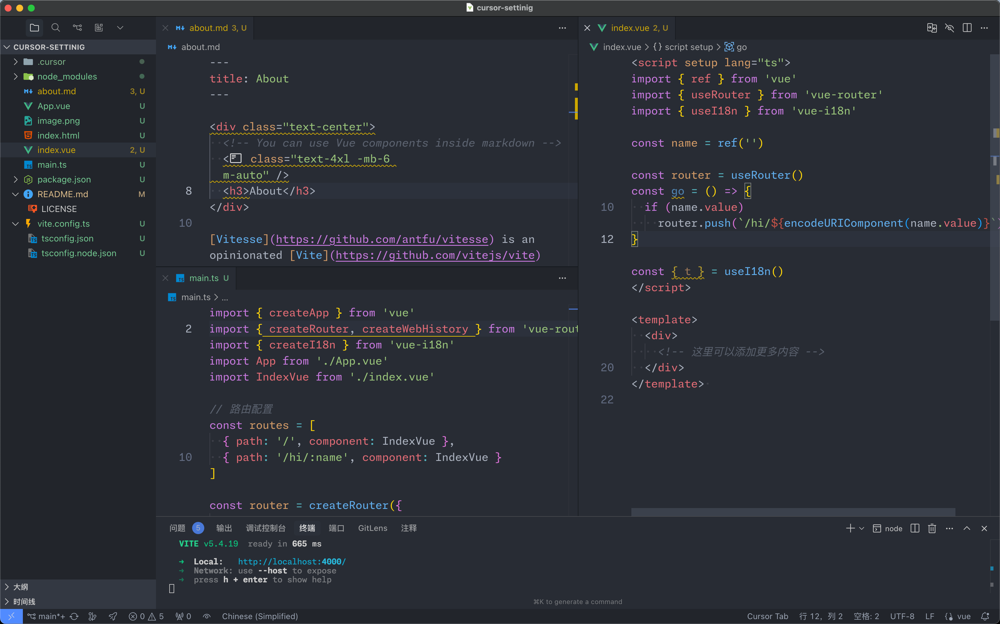
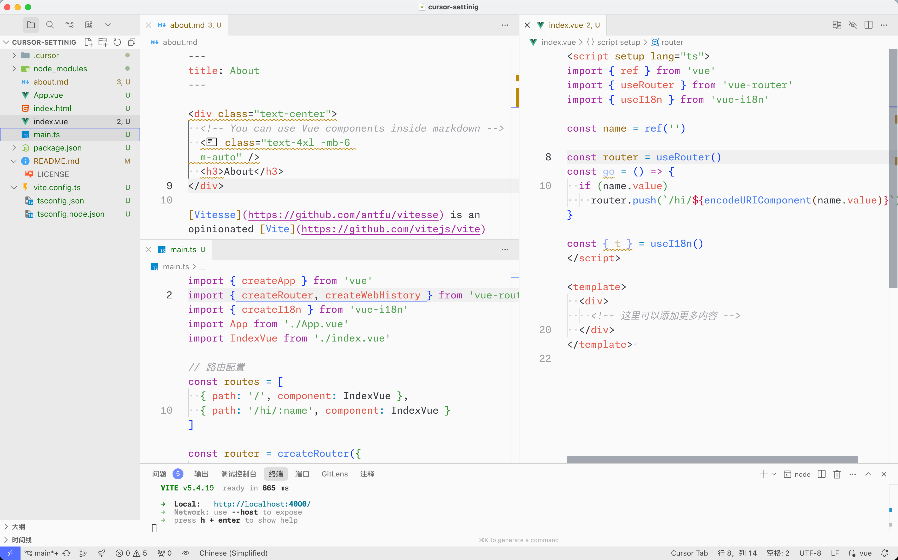

# Cursor 设置配置

**个人 Cursor 编辑器设置**

[`.cursor/settings.json`](./.cursor/settings.json)  
[`.cursor/extensions.json`](./.cursor/extensions.json)  
[`.cursor/global.code-snippets`](./.cursor/global.code-snippets)  
[`.cursor/mcp.json`](./.cursor/mcp.json)  
[`.cursor/rules/global-rules.md`](./.cursor/rules/global-rules.md)

## 预览

### 深色主题

### 浅色主题  

| 配置项 | 值 |
|--------|-----|
| 主题 | Atom One Dark / Atom One Light |
| 字体 | Monaspace Neon Var, JetBrains Mono, Fira Code, Input Mono |
| 文件图标 | Material Icon Theme |
| 产品图标 | Carbon |

## 扩展

### 核心开发

- Vue.volar - Vue 3 语言支持
- Nuxtr - Nuxt 开发工具
- ESLint - 代码质量检查
- Prettier - 代码格式化
- Vitest Explorer - 测试运行器

### UI 和主题

- Material Icon Theme - 文件图标
- Carbon Icons - 产品图标
- Atom One Dark - 深色主题
- Atom One Light - 浅色主题
- Iconify - 图标预览

### CSS 和样式

- UnoCSS - 原子化 CSS 框架
- Tailwind CSS - 实用优先的 CSS 框架

### 开发工具

- GitLens - Git 增强
- File Nesting - 文件嵌套
- PNPM Catalog Lens - 包管理工具
- Goto Alias - 路径别名跳转
- i18n Ally - 国际化支持
- Comment Translate - 注释翻译

### 文件处理

- SVG Preview - SVG 预览
- XML - XML 语言支持
- Markdown Lint - Markdown 检查

### 实用工具

- VSCode Counter - 代码统计
- Live Server - 本地服务器
- 中文语言包 - 界面中文化

## 许可证

MIT
